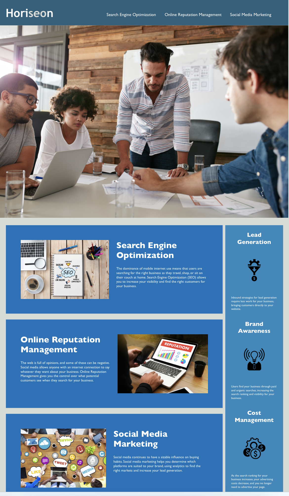
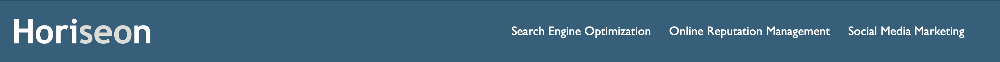
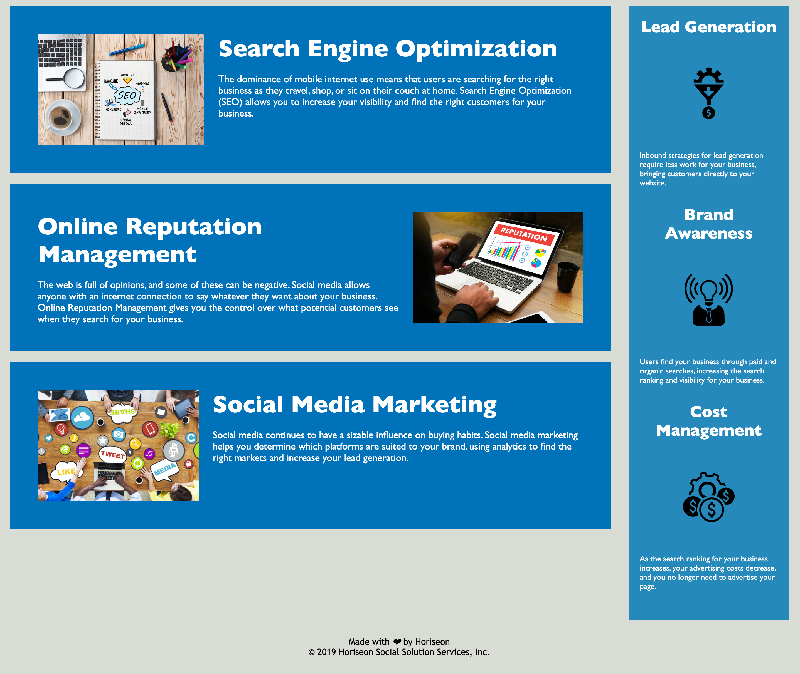

# The Horiseon Marketing Agency- Webpage Accessibility Improvements

## Description 

The codebase of Horiseon Marketing Agency webpage has been improved to follow the newest accessibility standards to ensure that web users with disabilities can access a website using assistive technologies. Additionally, accessibility improvements applied enable better positioning in search engine like Google so that people may quickly find the business webpage online.

The webpage has been improved by adding semantic HTML elements to the basecode and improving the logical structure independent of styling and positioning. Images have been enriched with accessible 'alt' attributes. CSS styling file has been cleared up and standardized. 

The newest version of the [Horiseon Webpage](https://mrsannanoga.github.io/horiseon-marketing-agency/#search-engine-optimization) is deployed and live to audience.

 

## Installation

N/A

## Usage 

The Horiseon webpage includes a navigation bar with the name of the business on the left site and a menu on the right site with navigation function to find what the user is looking for by clicking on the one of the components.

Below the navigation bar, there is a header image, followed by cards which can be navigated from the menu section. These cards contain the main content and related images. On the right site of the webpage, there is an align section with additional information.

## License

MIT Licence.

